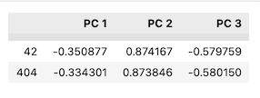
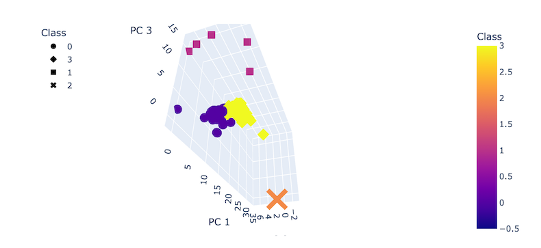
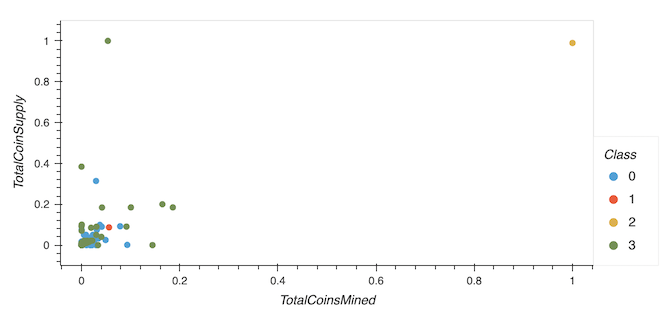

# Cryptocurrencies
Unsupervised Machine Learning

## Project Overview

Process and analyze a cryptocurrency dataset to fit the unsupervised machine learning model, create a report that includes what cryptocurrencies are on the trading market and how they could be grouped to create a classification system for a new investment in cryptocurrency.

## Design Solution

Preprocessing the data por PCA

Reducing Data Dimensions Using PCA

Clustering Cryptocurrencies Using K-means

Visualizing Cryptocurrencies Results

### Results

### Principal Components

The dataframe above shows the three principal components (PCAs) generated, where data is aggregated together by the similarity of the features.

Threee PCAs were calculated 

### Elbow Curve Plot

Defining the k value on a range from 1 to 10, then using the K-mean algorithm to iterate through the k value, find their inertia and store it into a dataframe, that can then be used to generate the elbow curve plot shown below.

After analyzing the elbow curve, it can be seen that the angle at point 4 looks like an elbow, which means using 4 clusters for the analysis is a good option.

### 3D Plot

The above 3D Plot takes in 3 axis; x, y, and z corresponding the three PCAs previously calculated. This plot confirms that diving the groups into four cluster makes sense, where we can see that there are four distinct groups that correspond to the four clusters that we expected the model to break the data into.  

### Scatter Plot

The scatter plot above is generated without the PCA values and that is why it is harder to see the four distinct clusters, in other words since we cannot see the depth of the points it is hard to tell if they were ideally grouped.

### Summary

The best way to see the results, was represented by the 3D scatter plot that takes in the PCA values as the 3 axis, where the four different clusters can be seen. The clusters represented by the colors yellow and purple are the ones with more concentration of points. Something that has caught my attention was the class 1, represented by the big pink X on the 3D plot, the fact that it is a single point and is very far from all the other points could mean that it is an outlier, which could be skewing our data into four clusters, which could have easily been only three.. I suggest that this specific point should be investigated, possibly removed, and the results recalculated. In addition to that the other clusters should be analized using the dataframes for each class to check for patterns and relations that made them to be grouped together.

