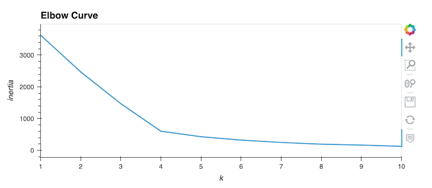

# Cryptocurrencies
Unsupervised Machine Learning

## Project Overview

### Results

### Summary

-------------------------------------------------------------------------------------------------------------------------------------------

Accountability Accounting, a prominent investment bank, is interested in offering a new cryptocurrency investment portfolio for its customers. The company, however, is lost in the vast universe of cryptocurrencies. So, they’ve asked you to create a report that includes what cryptocurrencies are on the trading market and how they could be grouped to create a classification system for this new investment.

The data is not ideal, so it will need to be processed to fit the machine learning models. Since there is no known output for what you are looking for, she has decided to use unsupervised learning. To group the cryptocurrencies use the clustering algorithm. Using data visualizations to share the findings with the board.

